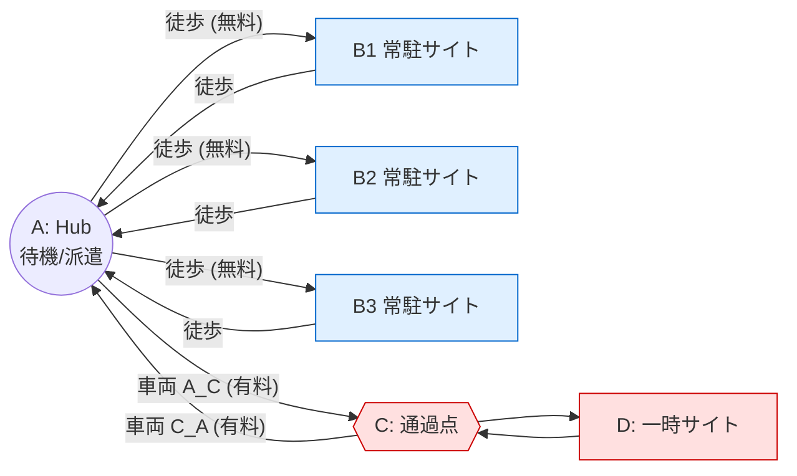
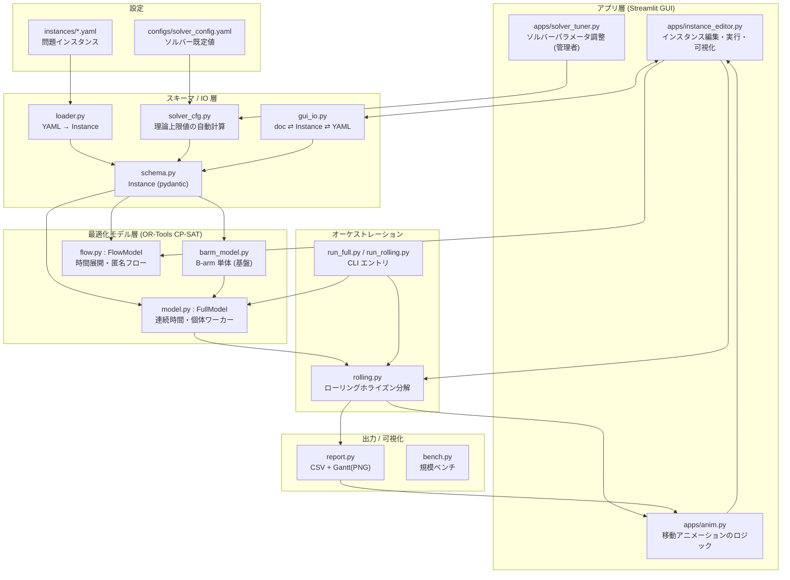
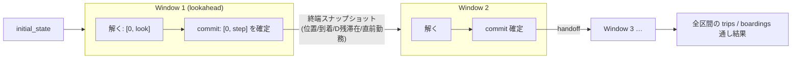
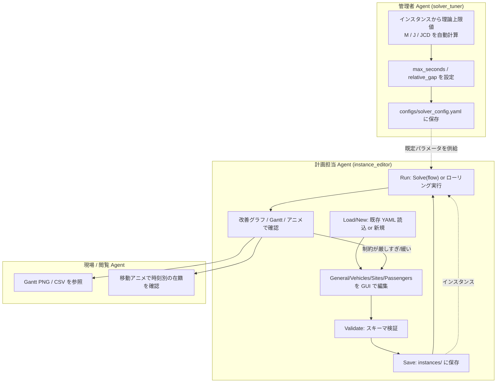
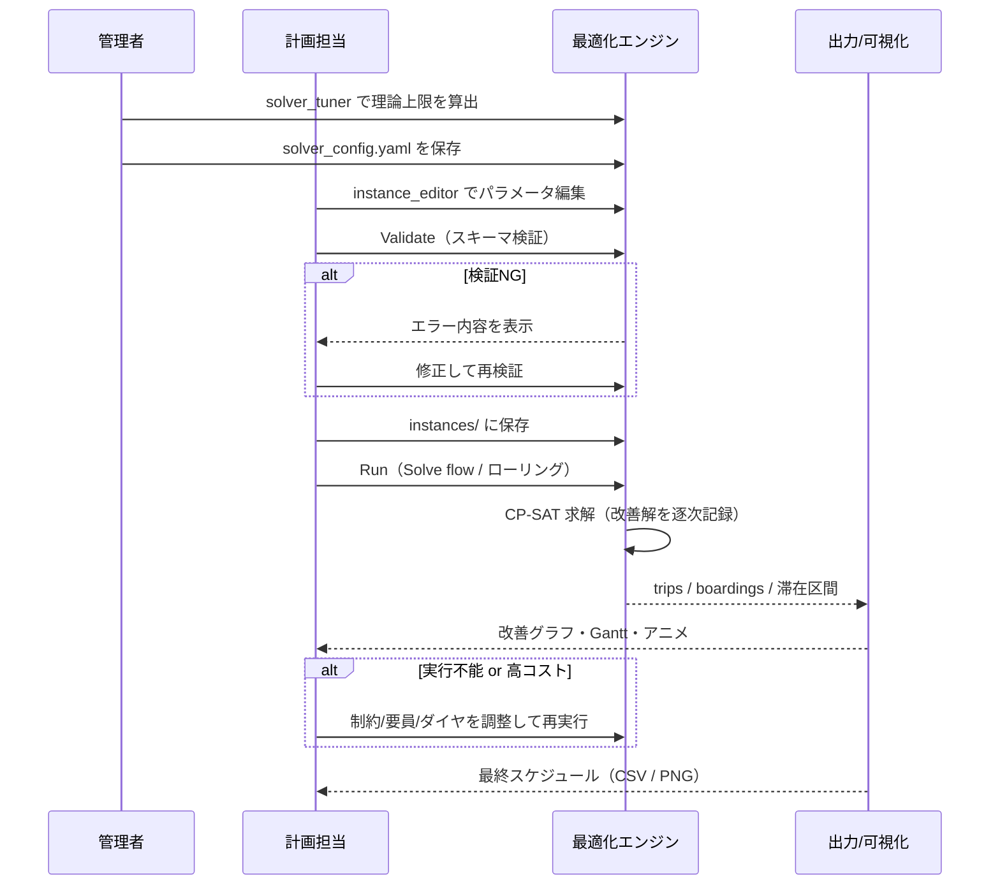
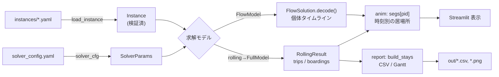

# How to Use & Architecture — 固定ルート人員ローテーション最適化

固定ルート上で人員（乗客）を輸送し、各拠点の常駐・滞在・同乗・ローテーション条件を満たしながら
**車両運行費を最小化**する最適化システムのアーキテクチャと利用フローをまとめる。
問題の厳密な仕様は [spec.md](spec.md)、CP-SAT 定式化は [model.md](model.md)、規模検証は [BENCH.md](BENCH.md) を参照。

---

## 1. 何を解く問題か（ドメイン）

固定ルート `A → Bx → A → C → D → C → A` を計画期間内で周回し、以下を満たす人員配置・配車を決める。

- **A**: 本拠点（Hub）。人員はここで待機し、ここから派遣される。
- **Bx（B1/B2/B3…）**: 常駐サイト。各島に「常駐 min / カテゴリ要件 / 滞在ウィンドウ[min,max]」がある。`A↔Bx` は**徒歩**（車両不要・コスト0）。
- **C**: 通過点（滞在なし）。車両の折返し・積替え地点。
- **D**: 一時サイト。滞在時間は「その便の同乗総人数 × 体重区分」で決まる（min のみ）。
- **配車が要るのは `A↔C` 区間のみ**。運行費はここだけに発生する。



**駆動力＝必須ローテーション**: 各乗客は勤務（滞在）を **B → D → B → D …** と交互に行わねばならない。
要員プールが逼迫すると、同じ人が再び B に就くため間に D 勤務を挟む必要が生じ、`A↔C` の配車需要（コスト）が発生する。

---

## 2. アーキテクチャ全体像

コードは「スキーマ／IO」→「最適化モデル」→「オーケストレーション」→「出力／可視化」→「アプリ（GUI）」の層構造。



### 主要モジュール

| モジュール | 役割 |
|---|---|
| [route_opt/schema.py](route_opt/schema.py) | `Instance` を頂点とする pydantic スキーマ。制約・整合性検証もここ。 |
| [route_opt/loader.py](route_opt/loader.py) | YAML → `Instance`、休日時間帯など派生値の計算。 |
| [route_opt/barm_model.py](route_opt/barm_model.py) | B-arm（A→B→A 交代輸送）の CP-SAT モデル。Full の基盤。 |
| [route_opt/model.py](route_opt/model.py) | `FullModel`：B-arm + CD-arm。連続時間・個体ワーカー・ローテーション。 |
| [route_opt/flow.py](route_opt/flow.py) | `FlowModel`：固定ダイヤ前提の時間展開フローモデル（匿名フロー＋経路分解）。長 horizon を単発で解ける。 |
| [route_opt/rolling.py](route_opt/rolling.py) | ローリングホライズン分解ドライバ（`FullModel` を反復）。 |
| [route_opt/report.py](route_opt/report.py) | 解 → 滞在区間再構成 → CSV / Gantt(PNG)。 |
| [route_opt/solver_cfg.py](route_opt/solver_cfg.py) | `configs/solver_config.yaml` 読込＋理論上限値の自動計算。 |
| [route_opt/gui_io.py](route_opt/gui_io.py) | GUI 用 doc(JSON) ⇄ `Instance` ⇄ YAML の round-trip 変換。 |
| [apps/instance_editor.py](apps/instance_editor.py) | メイン GUI。編集・検証・保存・求解・可視化まで一貫。 |
| [apps/solver_tuner.py](apps/solver_tuner.py) | 管理者向け。理論上限値を確認し `solver_config.yaml` に保存。 |
| [apps/anim.py](apps/anim.py) | 解の「時刻 t に誰がどこに居るか」を計算しアニメーション化。 |

---

## 3. 2つの求解モデル

同じ `Instance` を、性質の異なる2つの CP-SAT 定式化で解ける。

| | `FullModel` ([model.py](route_opt/model.py)) | `FlowModel` ([flow.py](route_opt/flow.py)) |
|---|---|---|
| 定式化 | 連続時間・**個体ワーカー**（乗客を識別） | 時間展開グリッド・**匿名フロー**（コモディティ=(サイト,カテゴリ,体重)） |
| ダイヤ | 自由ダイヤ可 | **固定ダイヤ必須**（`a_c_departures`） |
| 長所 | 表現力が高い（任意の初期状態を扱える＝ローリング接続向き） | ワーカー対称性・弱下界を排し、**長 horizon を単発**で解ける |
| 個体復元 | モデルが直接持つ | 求解後に FIFO で**経路分解 (`decode`)** して復元 |
| 主用途 | ローリングホライズン分解の各ウィンドウ | GUI の単発ソルブ（Solve single, flow） |

いずれも目的は同一：**Σ（配車台数 × 運転時間 × 時間単価）を最小化**。車両費は `A↔C` 便のみに発生。

---

## 4. ローリングホライズン分解

長 horizon（およそ3週間超）は単一モデルでは feasible 解の発見が難しいため、
[rolling.py](route_opt/rolling.py) が `FullModel` をウィンドウ反復で解く。



- `window_days`（= lookahead, 解く長さ）と `step_days`（= commit, 確定して次へ進む長さ）を指定。
- `overlap = lookahead − commit` がシーム（境界）常駐者の余裕を生み、**§17 ローテーションを境界越しに維持**する。
- 各ウィンドウ終端では全員が「サイト常駐 or A 待機」（移動中はいない）ため、スナップショットが一意に取れる。

---

## 5. Agent（運用主体）の業務フロー

システムは3つの役割（Agent）が関わる。**管理者**がソルバー基盤を整え、**計画担当**がインスタンスを組んで求解し、
**現場／閲覧者**が結果を確認する。



### 業務フローの時系列



---

## 6. 使い方（How to Use）

### 6.1 GUI（推奨）

```bash
# メイン: インスタンス編集～求解～可視化
streamlit run apps/instance_editor.py

# 管理者: ソルバーパラメータの理論上限確認と保存
streamlit run apps/solver_tuner.py
```

`instance_editor` のタブ構成（[apps/instance_editor.py:1243](apps/instance_editor.py#L1243)）:

`Load/New` → `General` → `Vehicles & Fleet` → `Sites` → `Passengers` → `Validate & Save` → `Run` → `移動可視化`

- **Run** タブで `Solve (single, flow)`（`FlowModel`）またはローリング実行を選ぶ。
- 求解中の改善解は逐次記録され、「解の改善グラフ（時刻×コスト）」で確認できる。
- **移動可視化** タブでタイムスライダーにより各拠点の在籍・移動中人数をアニメーション表示。

### 6.2 CLI

```bash
# 単一ウィンドウで Full モデルを解く
python -m route_opt.run_full instances/full_small.yaml

# ローリングホライズン（lookahead=6日, commit=5日）で解き CSV+Gantt を出力
python -m route_opt.run_rolling instances/full_cd.yaml 6 5
# → out/trips.csv, out/stays.csv, out/schedule_gantt.png
```

### 6.3 インスタンスの構造（YAML）

`Instance`（[route_opt/schema.py:233](route_opt/schema.py#L233)）の主な要素:

- `planning_horizon` / `calendar`（休日は全運休）
- `vehicle_types`（capacity, cost_per_hour）/ `fleet.owned`（個体・初期位置・`a_c_departures` ダイヤ）
- `staffed_sites`（島ごと: `occupancy_min` / `category_requirements` / `stay{min,max}` / `ride_together` / `segments`）
- `cd_arm`（A_C/C_D/D_C/C_A 所要）/ `temporary_site`（`d_stay_table`：体重×人数→滞在h）
- `passengers`（category, weight）/ `passenger_rules`（赴任可能 B 島）/ `masters`（選択肢マスタ）
- `await_min_by_category`（カテゴリ毎の A 待機最低人数）/ `initial_state` / `solver` / `display`

例は [instances/full_cd.yaml](instances/full_cd.yaml)、[instances/full_small.yaml](instances/full_small.yaml) を参照。

---

## 7. データフロー（求解1回の流れ）



---

## 8. 参考ドキュメント

- [spec.md](spec.md) — 問題仕様（制約の定義・確定事項）
- [model.md](model.md) — CP-SAT 定式化の詳細
- [BENCH.md](BENCH.md) — 規模・性能検証（フローモデルの設計根拠を含む）
